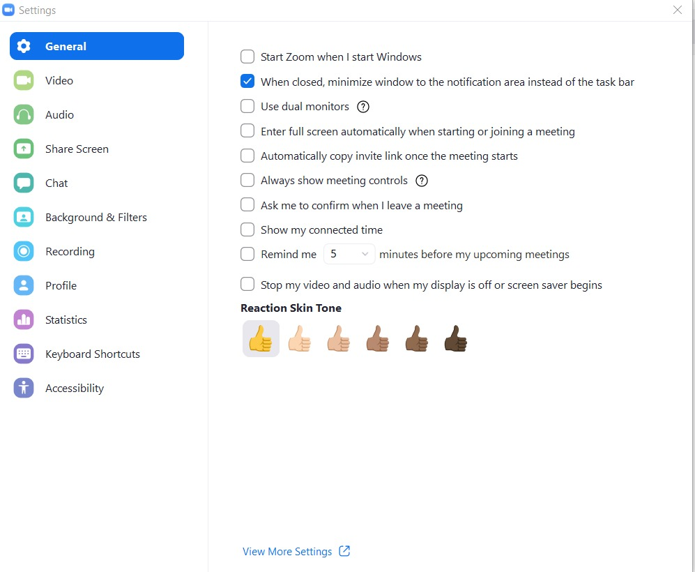

# Zoom Automation
An automation GUI to automatically join a scheduled zoom meeting at a specific time without manual labour.
## Requirements 
- [x] Installed python version above 3.5
- [x] Installed pandas package
- [x] Installed tkinter package
- [x] Installed keyboard package
- [x] Updated Zoom Software (Signed in)
#### To install the above packages :
+ To [Download Python](https://www.python.org/downloads/)
+ `pip install pandas`
+ `pip install tkinter`
+ `pip install keyboard`
+ To [Download Zoom Software](https://zoom.us/download#client_4meeting)
## Setting up configurations :
##### Set the General Settings as follows :

## About the team
This was developed for Makeathon 3077 by the team K-PHAM comprising of:
+ [Ankit Singla](https://github.com/ankitsingla8427)
+ [Harneet Singh Kohli](https://github.com/harneetkohli)
+ [Kunal Pathak](https://github.com/stillearning2)
+ [Muskan Aggarwal](https://github.com/muskan024)
+ [Poorvika Khanna](https://github.com/poorvika7khanna)
#### Stage of development
At present the program works for a single day, but we will extend it for a full week with time.
